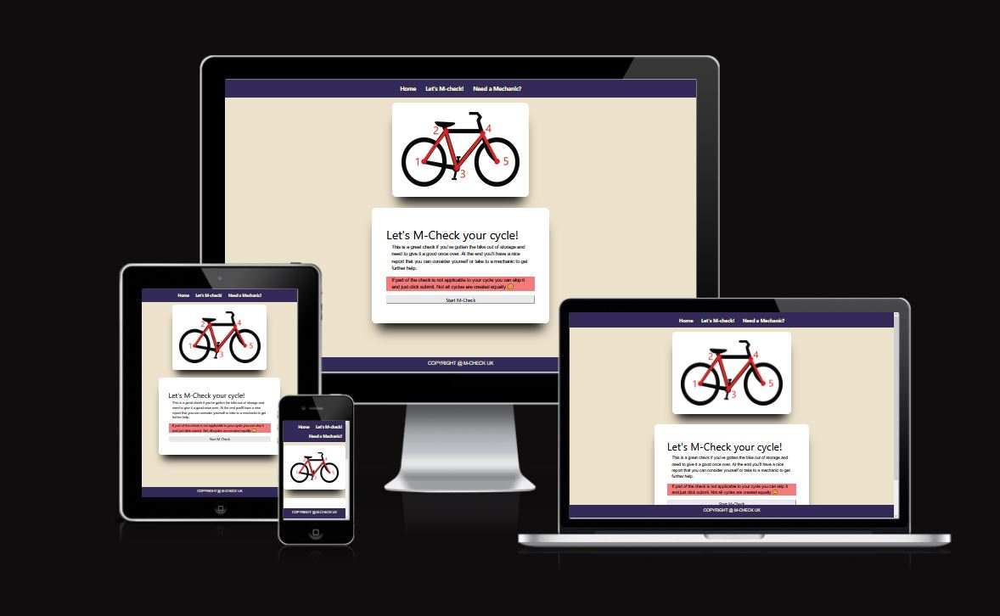
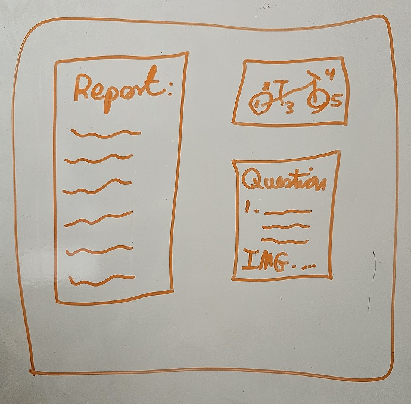
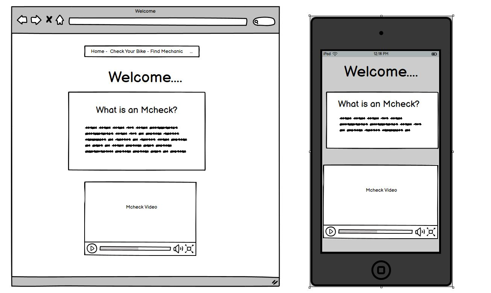
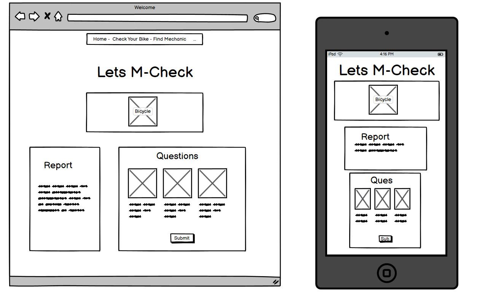
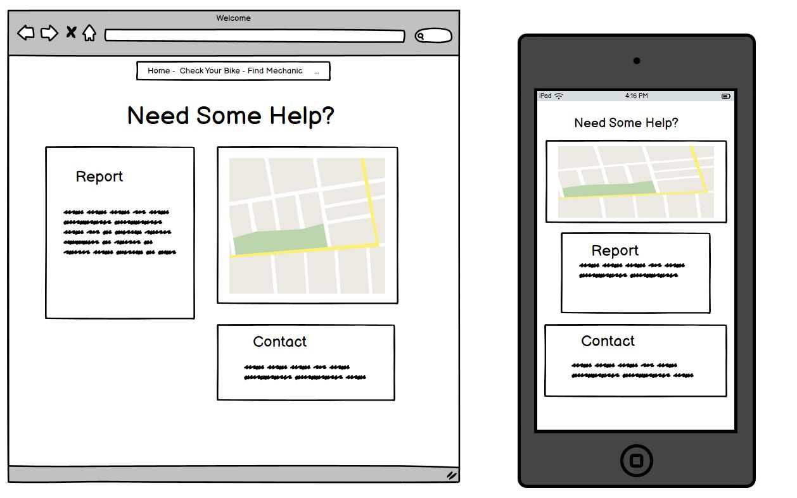
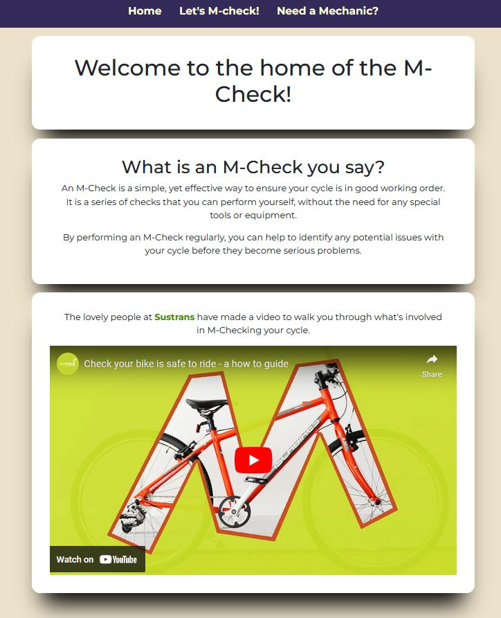
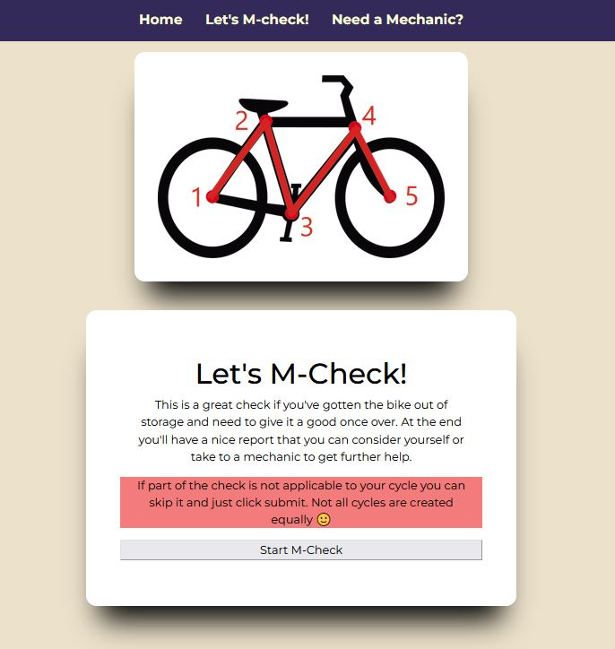
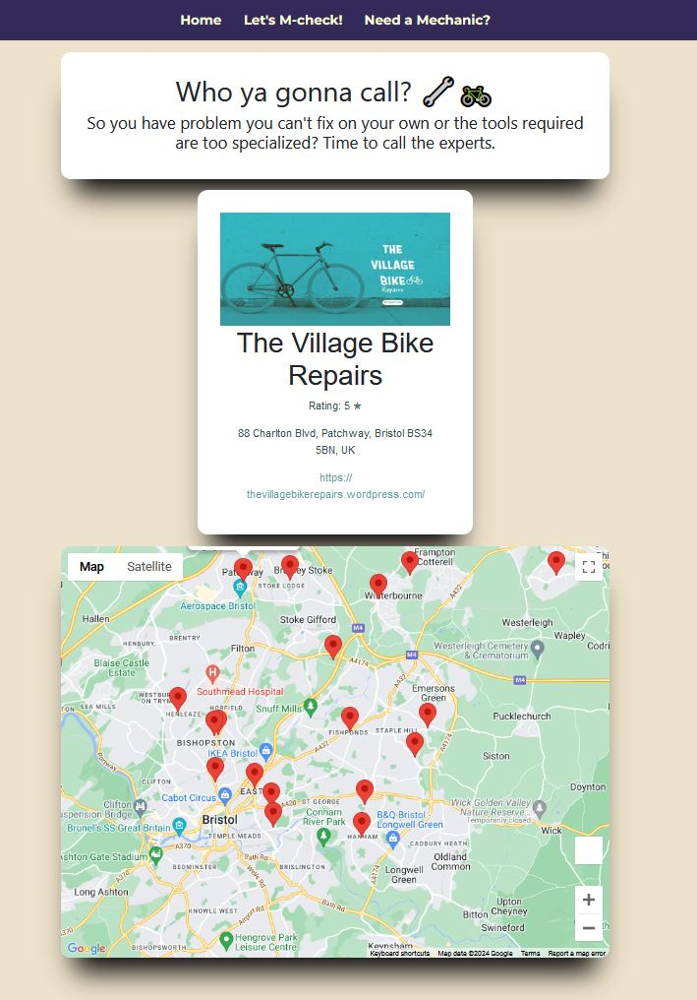

<div align="center">
  
</div>

<a target="_blank" href="https://blockhead77.github.io/mcheck/">The M-Check Reporting Tool</a> has been created to help those lacking in mechanical knowledge, to properly diagnose their cycle's safety or roadworthiness.

## Table of Contents
1. <details open>
    <summary><a href="#user-experience">User Experience</a></summary>

    <ul>
    <li>
    <details>
    <summary><a href="#goals">Goals</a></summary>

    - [Visitor Goals](#visitor-goals)
    - [Business Goals](#business-goals)
    - [User Stories](#user-stories)
    </details></li>

    <li><details>
    <summary><a href="#visual-design">Visual Design</a></summary>

    - [Wireframes](#wireframes)
    - [Fonts](#fonts)
    - [Icons](#icons)
    - [Colors](#colors)
    - [Styling](#styling)
    </details></li>
    </ul>

2. <details open>
    <summary><a href="#features">Features</a></summary>

    <ul>
    <li>
    <details>
    <summary><a href="#page-elements">Page Elements</a></summary>

    - [All Pages](#all-pages)
    - [Index Page](#index-page)
    - [M-Check Page](#m-check-page)
    - [Mechanic Page](#mechanic-page)
    </details></li>
    

    <li><details open>
    <summary><a href="#technologies-used">Technologies Used</a></summary>
        
    - [Languages](#languages)
    - [Frameworks](#frameworks)
    - [Platforms](#platforms)
    - [Other Tools](#other-tools)
  </details></li>
  </ul>

3. <details open>
    <summary><a href="#testing">Testing</a></summary>

    <ul>
    <li><details>
    <summary><a href="#methods">Methods</a></summary>

    - [Validation](#validation)
    - [General Testing](#general-testing)
    - [Mobile Testing](#mobile-testing)
    - [Desktop Testing](#desktop-testing)
    </details></li>

    <li><details>
    <summary><a href="#bugs">Bugs</a></summary>

    - [Known Bugs](#known-bugs)
    </details></li>
    </ul>
</details>

4. <details open>
    <summary><a href="#deployment">Deployment</a></summary>

    <ul>
    <li><details>
    <summary><a href="#local-deployment">Local Deployment</a></summary>

    - [Local Preparation](#local-preparation)
    - [Local Instructions](#local-instructions)
    </details></li>

    <li>
    <details>
    <summary><a href="#github-deployment">Github Deployment</a></summary>

    - [Github Instructions](#github-instructions)
    </details></li>
    </ul>
</details>

5. <details open>
    <summary><a href="#credits-and-contact">Credits and Contact</a></summary>

    <ul>
    <li><details>
    <summary><a href="#credit-and-contact">Credit and Contact</a></summary>

    - [Content](#content)
    - [Contact](#contact)
    </details></li>
    </ul>
</details>

----

# User Experience
## Goals
### Visitor Goals
The target audience for the m-check tool are:
- People who want learn how to test their cycle for safety.
- Parents who want to check their child's cycle for safety.
- People who want to know when to take their cycle to a mechanic and seek further assistance.

Visitor goals are:
- Discover what an M-Check is.
- Find out how to check their cycle themselves.
- Find a mechanic in their local to help them.

The M-Check tool meets these needs by:
- Informing the visitor of what an M-check is with the help of an inline video.
- Walking the visitor through the steps to M-check their cycle.
- Using geolocation to find local mechanics through the Google Mpas API

### Business Goals
The Business Goals of the M-Check tool are:
- Promote use of local bike mechanic services.
- Enable people to diagnoses faults with their cycle and source parts or tools (possibly sell parts or tools).
- Linkng to local mechanics for a referal fee.

### User Stories
- As a parent/carer I need to know that my child's cycle is safe to use. If I can't fix it myself I'd like to find some help.
- As a regular rider I need to keep on top of my cycle's safety. By regularly checking my cycle I can be alerted to any issues developing over time.

## Visual Design
### Wireframes
- I initially sketched out the content I would have like to see as the mcheck was progressing
<div align="center">
  
</div>
- My aim was to keep it clean and streamlined.
<div align="center">
  
</div>
- Designing it on a PC I was tempted to spread it out to fill the page.
<div align="center">
  
</div>
- I especially liked the idea of having the report visible while you called a machanic to discuss.
<div align="center">
  
</div>
- In the end, after some testing, I streamlined the layout to be more mobile and tablet friendly. Feedback from users told me that users predominantly used mobiles and tablets while m-checking their bikes.
- As a result I went with a mobile first layout and removed the sections sitting side by side in favour of a columned approach.

### Fonts
- I wanted to use a simple and clear font and reseach showed me that Verdana was a clear and easy to read fon't that was readily available with google fonts.
- I didn't want anything fancy as I didn't want to add to the difficulty of progressing with the M-Check. When taking surveys or filling out forms I believe people want it to be hassle free and quick.
- Diffcult to read fonts can be frustrating and learning to do something while possibly holding a phone or tablet means you don't want to squinting at hard to read fonts.

### Icons
- I created a simple favicon of a bicycle for the site.
- The only other icons I used were standard emoji's as I wanted it to be less serious.

### Colors
<div align="center">
  
</div>

- I experimented with a few different colour palettes but in the end I started with the Red for the M-check and worked backwards from there. I wanted the M-check of the bicycle to eye catching and easy to follow.
- Then I created a soft background to making reading text easier.
- After that I used the same colour for the nav bar and chose a background that complemented the rest of the site and created an easy to read contrast.

### Styling
- I'm not the most artistic designer so I created the divs to appear like floating cards. Easy to follow sections with clearly defined lines. The shadowing offers depth at the bottom which I hoped would allow draw the eye down the page, pn to the next section.

----

# Features
## Page Elements
### All Pages
#### Navbar
<div align="center">
  
</div>

- Clean, easy to read and doesn't draw the eye from the content.

#### Footer
<div align="center">
  
  </div>

- Simple mirror to the nav bar, helping to bookend the page top and bottom.


### Index Page
<div align="center">
  
  </div>

- Straight forward intro to the M-Check with a video to explain the process.

### M-Check Page
<div align="center">
  
</div>

- The bicycle makes it obvious the steps that are going to be taken as we check the cycle.
- I chose to remove validation for each selection as cycles are sometimes very different in their design and build.

### Mechanic Page
<div align="center">
  
</div>

- Straight away it's clear what this page is for.
- I liked the fact that once you start clicking on business markers, the div that explained what to do becomes the informative div and reuses that space.

----

# Technologies Used
## Languages
- HTML
    * For page markup and layout.
- Javascript
    * For interactivity and programatic reponses.
- Css
    * For ease of styling multiple pages.

## Frameworks
- Bootstrap 5.0

## Platforms
- [Github](https://github.com/)
    * Storing code remotely and deployment.
- [Gitpod](https://gitpod.io/)
    * IDE for project development.

## Other Tools
- [Krita](https://krita.org/en/)
    * I used Krita to create the bicycle images and crop images for this readme - its an open source tool similar to Adobe Photoshop
- [Balsamiq](https://balsamiq.com/) 
    * was used to create the wireframes for the site layout.
- [Google Maps API](https://developers.google.com/maps)
   * provided a great tutorial and lots of resouces for beginner developers.

# Testing
## Methods
### Validation
<div align="center">
  
</div>
<div align="center">
  
</div>
<div align="center">
  
</div>
<div align="center">
  
</div>

- HTML has been validated with [W3C HTML5 Validator](https://validator.w3.org/).
- Accessibility has been validated with [Page Speed Insights](https://pagespeed.web.dev/).
- CSS has been validated with [W3C CSS Validator](https://jigsaw.w3.org/css-validator/).
- Javascript has been checked with [JSLint](https://www.jslint.com/).
    * JsLint showed 3 warnings, two of which were from code I was taught to use and one from google maps tutorial. When I attempted to rectify the google code related issue the code functionality breaks. Therefore I feel JsLint has poorly evaluated this.

### General Testing
- All links to external files open in new tabs and have been tested for that.
- Each time a feature was added, all the functions were tested to see if there was an impact.
- I sent the link to the site to fellow cycle enthusiasts for testing. Most said that more question could be asked and in more depth but this is just an example of what could be done.

### Mobile Testing
- I tested the site on Android devises and tablets as well as ipads and iphones. Going through the entire process, checking functions.
- I used Firefox, Edge and Chrome to ensure the site work accross the most popular platforms.

### Desktop Testing
- The site was developed on a desktop PC and testing we performed in chrome, firefox and edge as well as internet explorer's pervious versions.

## Bugs
### Known Bugs
- I wanted to utilise better validation in for the check process but could account for all the different types of cycles.
  as a result I allowed null selections to account for this.
- In future I will allow for different models fo cycles and incorporate testing accordingly.

# Deployment
## Local Deployment
### Local Preparation
**Requirements:**
- An IDE of your choice, such as [Visual Studio Code](https://code.visualstudio.com/)
- A GitHub account to allow you to access the repository [Git](https://github.com//)

### Local Instructions
- 1. Download a copy of the project repository [here](https://github.com/blockhead77/mcheck) and extract the zip file to your base folder. Or you can clone the repository with:
    ```
    git clone https://github.com/blockhead77/
    ```
    To disconnect it from the master repository, use:
    ```
    git remote rm origin
    ```
- 2. Open your IDE and choose the base directory.

- 3. Run the project with your chosen method. You can drop index.html into a web browser and it should run fine, open a local port and access it or, if you have python installed, run it on an HTTP server with python with the terminal command:
    ```
    python3 -m http.server
    ```
- 4. Enjoy!

## Github Deployment
### Github Instructions
1. Log in to your GitHub account.
navigate to [https://github.com/blockhead77/](https://github.com/blockhead77/).
1. You can set up your own repository and copy or clone it, or you can fork the repository.
2. `git add`, `git commit` and `git push` to a GitHub repository, if necessary.
3. GitHub pages will update from the master branch by default.
4. Go to the **Settings** page of the repository.
5. Scroll down to the **Github Pages** section.
7. Select the Master Branch as the source and **Confirm** the selection.
8. Wait a minute or two and it should be live for viewing.

## Credits and Contact
### Content
- All text used is my own.
- Code utilised from any other sites is documented and credited within the code.
- I used code from [DEVRUNOPS](https://devrunops.com/markdown-table-of-contents/) to help create this README.
- I used Google's tutorial on Map Api intergration and Google's code to make it work.
- All other media used is my own.

### Contact
- Please feel free to contact me at `stuartkellock@gmail.com`
